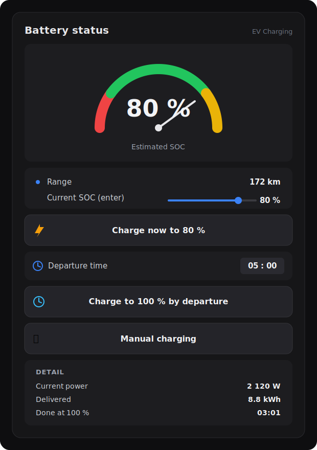

# 🔌 IONIQ EV Charging for Home Assistant


Smart charging package for the **Hyundai Ioniq Electric (28 kWh)** that turns an ordinary
metering smart plug into an intelligent charger — target-aware auto stop, battery-friendly
timed 100 % charging, live SOC / range / cost estimates, and voice + phone notifications.

<p align="center">
  
</p>

> 🇬🇧 English guide → **[IONIQ_EV_charging_guide_EN.md](IONIQ_EV_charging_guide_EN.md)**
> 🇨🇿 Český návod → **[IONIQ_EV_charging_guide_CZ.md](IONIQ_EV_charging_guide_CZ.md)**

No custom components, no HACS — just a single Home Assistant **package** file (helpers,
template sensors, scripts and automations) plus a Lovelace dashboard.

---

## ✨ Features

- **⚡ Quick Charge** — charge now to 80 %, auto-stops.
- **🕐 Charge to 100 % by departure** — 80 % now (in case you leave early), the rest to 100 %
  timed to finish exactly at your departure time (minimises time spent at high SOC).
- **🔧 Manual mode** — dumb on/off; HA never interferes, it only shows the live numbers
  (estimated SOC, ETA to 100 %, delivered kWh, cost).
- **Target-aware stop from real measurement** — the stop decision uses the actually metered
  energy + a tuned loss factor, **not** a fixed power constant, so it doesn't over/undercharge.
- **Interrupt-safe** — pull the plug mid-charge (e.g. a storm) and the real reached SOC is saved.
- **Cost & consumption** — per-session cost, monthly/yearly kWh and cost.
- **Range readout** — estimated km from SOC.
- **Failsafe** — recovers control if the plug ends up charging without an active mode.

The car model (battery, charger power, loss factors, range) lives in **one** `EV config`
block, tuned by real measurement for the Ioniq: `efficiency < 80 % = 0.95`, `charger = 2.12 kW`.

---

## 📦 What's in here

| File | Description |
|---|---|
| `IONIQ_EV_charging_EN.yaml` | The package (English strings) — drop into `/config/packages/` |
| `IONIQ_EV_charging_CZ.yaml` | The package (Czech strings) |
| `IONIQ_EV_charging_guide_EN.md` | Step-by-step beginner guide (English) — incl. dashboard YAML |
| `IONIQ_EV_charging_guide_CZ.md` | Step-by-step beginner guide (Czech) |

---

## 🚀 Quick start

1. **Enable packages** in `configuration.yaml`:
   ```yaml
   homeassistant:
     packages: !include_dir_named packages
   ```
2. Copy `IONIQ_EV_charging_EN.yaml` (or `_CZ`) into `/config/packages/`.
3. **Find & Replace** the tokens with your entities:
   | Token | Replace with |
   |---|---|
   | `switch.PLUG` | your smart plug switch |
   | `sensor.PLUG_power` | your plug's power sensor (W) |
   | `notify.MY_PHONE` | your phone notify service |
   | `media_player.MY_SPEAKER` / `tts.MY_TTS` | (optional) speaker + TTS |
4. Restart Home Assistant, add the dashboard from the guide, set your price, and charge.

Full walkthrough with screenshots-worth of detail is in the guides above.

---

## 🔧 Requirements

- Home Assistant (HAOS / Supervised / Container).
- A smart plug that can **switch on/off** and **report power in watts**
  (e.g. Shelly Plug S, Tapo P110, Athom/Tasmota).
- Home Assistant Companion app for phone notifications (optional but recommended).

> ⚠️ The Ioniq draws ~9–10 A (~2.1 kW) continuously for hours. Use a quality plug and circuit.

---

## 🚗 Other EVs

Written and tuned for the Ioniq Electric 28 kWh, but it works for any AC-charged EV — just
edit the `EV config` block (battery kWh, charger kW, loss factors, range) and re-tune the
efficiency after a couple of charges (see "Fine-tuning" in the guide).

---

## 📝 Changelog

- **v1.3 (2026-07-07)** — Fix: removed `initial:` from `ev_mode`, `ev_soc_target` and the price
  helper so mode, target and price **survive an HA restart**. Previously a restart mid-charge reset
  the mode to `Off` and the target to 80 %, silently cancelling a scheduled 100 %-by-departure
  charge (and the price reverted to the shipped default). The failsafe automation now also requires
  `ev_kwh_needed > 0`, so it can no longer trigger a spurious stop right after startup.
- **v1.2 (2026-07-05)** — Fix: session baseline captured on plug-ON (not power > 50 W); a short
  mid-charge pause no longer resets the counter (previously caused overcharge).
  Measured tuning: efficiency < 80 % = 0.95, charger power = 2.12 kW.
- **v1.1 (2026-06)** — Manual mode + ETA-to-100 % sensor; save real SOC on manual interrupt;
  stop-on-target ignores Manual.
- **v1.0 (2026-05)** — Base: Quick Charge, two-phase charge to 100 % by departure,
  SOC/cost/range, monthly/yearly consumption, failsafe.

---

## 📄 License

Released under the [MIT License](LICENSE) — free to use and modify.
Made for the Hyundai Ioniq Electric 28 kWh community.
